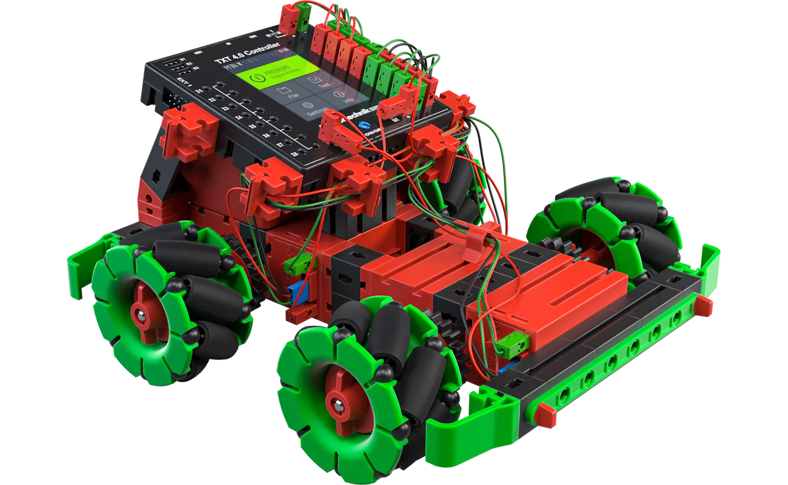

# omniwheels_x4_write

Writing robot application for original Fischertechnik Robotics Hightec model omniwheel_x4_paint ('Malroboter'), including the TXT 4.0 Controller with original operating system and configuration. Uses four omniwheel drives and pen actuator to write letters entered on touch display and strings from voice control. See it in action [here](https://www.youtube.com/shorts/Xx8kl2NqLEE).

The application has been developed in Python with the [Fischertechnik ROBO Pro Coding](https://www.fischertechnik.de/en/apps-and-software) tool. The *.blockly and *.xml files have been auto-generated by the tool.
